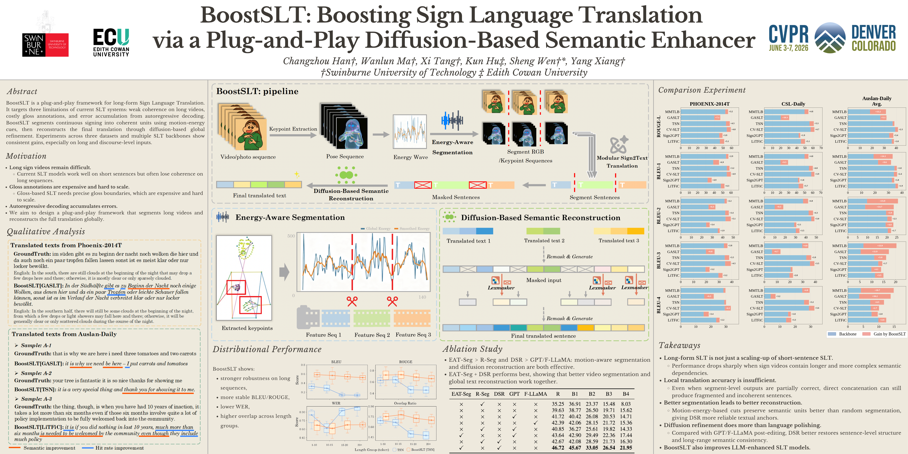

# BoostSLT: Boosting Sign Language Translation via a Plug-and-Play Diffusion-Based Semantic Enhancer




## Overview

BoostSLT is a novel framework for improving Sign Language Translation (SLT) quality, especially for long-form and discourse-level inputs.

### Motivation & Gaps

 - Long sign videos remain difficult: Current SLT models work well on short sentences but often lose coherence on long sequences.
 - Gloss annotations are expensive and hard to scale: Gloss-based SLT needs precise gloss boundaries, which are expensive and hard to scale.
 - Autoregressive decoding accumulates errors. 
 - We aim to design a plug-and-play framework that segments long videos and reconstructs the full translation globally.

### Key Features

- **Energy-Aware Temporal Segmentation (EAT-Seg)**: Unsupervised segmentation of long sign videos into semantically coherent segments based on motion energy analysis
- **Diffusion-Based Semantic Reconstruction (DSR)**: Iterative refinement of fragment-level translations into globally fluent paragraphs using diffusion language modeling
- **LexMasker**: Lexically-aware re-masking mechanism that preserves content words while refining function words during diffusion
- **Plug-and-Play Architecture**: Compatible with any existing SLT model (gloss-based or gloss-free)

## Project Structure

```
BoostSLT/
├── EAT_Seg/                    # Energy-Aware Temporal Segmentation module
│   └── main.py                # Main segmentation pipeline
├── DSR/                        # Diffusion-Based Semantic Reconstruction module
│   ├── dsr.py                 # Core DSR implementation with diffusion process
│   ├── lexmasker.py           # LexMasker component for lexical-aware re-masking
│   ├── prediction.py           # Batch inference script for DSR
│   └── base_predict.py         # Base prediction script for LLM-based reconstruction
├── data_process/               # Data preprocessing utilities
│   └── feature_extraction.py  # I3D feature extraction from videos
└── README.md                   # This file
```

## Environment Setup

### System Requirements

- **Python**: 3.8 or higher (3.9+ recommended)
- **CUDA**: 11.8 or higher (for GPU acceleration)
- **GPU**: NVIDIA GPU with at least 8GB VRAM (recommended for DSR module)
- **RAM**: At least 16GB (32GB recommended for large models)
- **Disk Space**: At least 10GB for dependencies and model weights

### Python Package Installation

#### Step 1: Create Virtual Environment (Recommended)

```bash
# Create virtual environment
python3 -m venv venv

# Activate virtual environment
# On Linux/Mac:
source venv/bin/activate
# On Windows:
venv\Scripts\activate
```

#### Step 2: Install PyTorch

Choose the appropriate PyTorch installation based on your CUDA version:

```bash
pip install torch torchvision torchaudio
```

```bash
pip install torch torchvision torchaudio
```

#### Step 3: Install Core Dependencies

```bash
# Core dependencies
pip install transformers>=4.30.0
pip install numpy>=1.21.0
pip install tqdm>=4.65.0

# For video processing (required for feature extraction)
pip install opencv-python>=4.5.0

# For SafeTensors support (recommended for model loading)
pip install safetensors>=0.3.0
```

#### Step 4: Install Optional Dependencies

**For I3D feature extraction:**
```bash
# Install pytorch-i3d (if needed for feature extraction)
# Option 1: From GitHub
find the repos: pytorch-i3d

# Option 2: If you have a local copy
cd /path/to/pytorch-i3d
pip install -e .
```

**For advanced POS tagging in LexMasker (optional):**
```bash
pip install spacy>=3.4.0

# Download language models
# For German:
python -m spacy download de_core_news_sm

# For English:
python -m spacy download en_core_web_sm
```

**Note**: LexMasker works with rule-based classification by default, so spacy is optional.

#### Step 5: Verify Installation

```bash
# Test core imports
python -c "import torch; import transformers; import numpy; import cv2; print('All core packages installed successfully!')"
```

### Complete Installation Script

For convenience, here's a complete installation script:

```bash
#!/bin/bash

# Create virtual environment
python3 -m venv venv
source venv/bin/activate

# Upgrade pip
pip install --upgrade pip

# Install PyTorch (adjust CUDA version as needed)
pip install torch torchvision torchaudio 

# Install core dependencies
pip install transformers>=4.30.0 numpy>=1.21.0 tqdm>=4.65.0 opencv-python>=4.5.0 safetensors>=0.3.0

# Install optional dependencies
pip install spacy>=3.4.0
python -m spacy download de_core_news_sm

echo "Installation complete!"
```

## Usage

### 1. Energy-Aware Temporal Segmentation

Configure paths and hyperparameters in `EAT_Seg/main.py`:

Run segmentation:
```bash
cd EAT_Seg
python main.py
```

### 2. Feature Extraction (Optional)

If using I3D features for translation:

```bash
cd data_process
python feature_extraction.py \
    --video_dir /path/to/videos \
    --data_file /path/to/data.pkl \
    --output_dir /path/to/features \
    --weights /path/to/i3d_weights.pth \
    --window_size 8 \
    --stride 2
```

### 3. Diffusion-Based Semantic Reconstruction

#### Using DSR Module with LexMasker

Configure in `DSR/prediction.py`:

Run reconstruction:
```bash
cd DSR
python prediction.py
```

#### Using Base Prediction (Standard LLM)

For comparison or when diffusion model is not available:

```bash
cd DSR
python base_predict.py
```

Configure paths and hyperparameters in the script before running.
